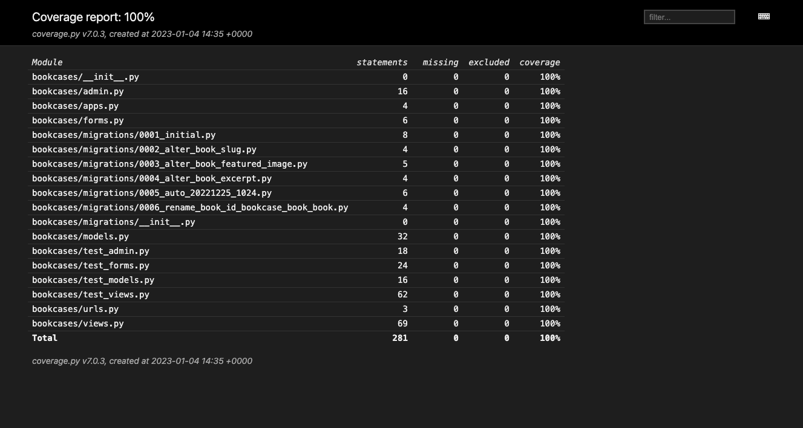
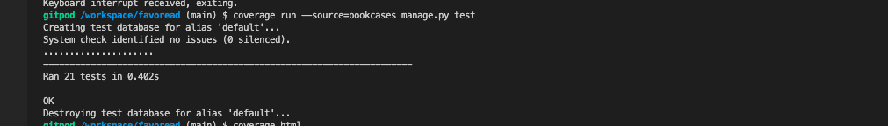

#FavoReads

Welcome,

In this document I will explain the reason and approach behind the FavoReads app. Imagine this, you just finished reading a good book, and now you have to look for another one. You don't have any inspiration and therefore you just my browse Amazon for hours. Wouldn't it be so much nicer to get book inspiration from someone who inspires you? Do you admire that one soccer player, or that bosswoman? Check out their bookcase and find your next book to read. In addition, you might also be an inspiration to others, so make sure you share your bookcase as well!

FavoReads is an application where users can create their own online bookcase while also being able to see the bookcases of other users. 

The last update to this file was: **January 14, 2023**

## Deployed project
The app can be accessed via the following link:

## User Stories
**User stories**
| User Story ID | As a/an | I want to be able to... | So that I can... |
| --- | ----------- | ----------- | ----------- |
 | Book inspiration | 
| 1 | Registered User | View a list of bookcase (owners) | get inspiration for my next book | 
 | 2 | Registered User | View individual books | So I can specifically add that book to my bookcase| 
 | 3 | Registered User | See an embedded google maps map | Plan my journey to the site from my location | 
 | 4 | Registered User | Display my own bookcase | So I can inspire others with the books I read| 
 | Registration and User Accounts | 
 | 8 | Unregistered User | Easily register for an account | Join this book community | 
 | 9 | Registered User | Easily login or logout | View bookcases, upload books, and manage my bookcase | 
 | 10 | Registered User | Easily recover my password | Access my account even if I've forgotten my password | 
 | Landing Page | 
 | 28 | Site Owner | Showcase books | Give website visitors a quick sense of the types of books and functionalities available on my website | 

## General Instructions and features

**Features**

* Username input: the player is asked to insert his/her name.

* Instructions input: the player can choose to read the instructions, or not.

* Guess input: the user can insert his guess for a row and column.

* Input validation: the player gets feedback when the input is not valid. The validation checks for range(0-4), type(number), and if the guess has already been made before.

* Score board: to give the player a quick overview of the scores instead of counting the H's, a score board is displayed with the hit rate of both player and computer.

* Boards: both the player's board and the computer's board are displayed. An 'H" represents a HIT, an X represents a MISS. The location of the player's ships are represented by an @. The computer's ships are hidden.

* Result: after 4 ships are sunk by either the player or the computer, the game will display a result message.

**Future Features**
The following features would be nice to add in the future:

* Letting the player decide the size of the grid
* Letting the player decide the number of ships
* Being able to add ships that are larger than one dot on the grid

## Design & wireframing
**Design & Colourscheme**
The design of the FavoReads application is based on the image below. Four colours are extracted and used for the main elements on the page. An additional colour was picked for the typografie. 
* Color for NavBar and Icons: #41585A
* Color for buttons and excerpt: #9A602A
* Color for background and white text: #F2EEED
* Color for footer and author: #A19F9E
* Color for text: #241F1C

**WireFrames**
[Click here for related user story.](https://github.com/MerelMoehn/favoreads/issues/20)
The wireframes created for this project were made in the online tool Miro. 

The wireframes were used as a rough sketch of what the application was meant to do and look like. This included the page navigation, the different pages needed, and a rough sketch of the design.
After initial set up of the main features the design was further implemented based on the design as described above.

## Data model
[Click here for related user story.](https://github.com/MerelMoehn/favoreads/issues/14)
The data model was created in LucidChart. 

## External Libraries
For this project I made us of several external libraries:
* SummerNote
* Coverage
* AllAuth
* Crispy Forms

## Testing
**Validators**
All custom code passed the the CI Python Linter validation, without any errors.
The following files were passed through the linter:
* admin.py
* apps.py
* forms.py
* models.py
* test_admin.py
* test_forms.py
* test_models.py
* test_views.py
* urls.py
* views.py

Each site page has been checked with Lighthouse and the following improvements have been made:
* Using smaller images to load page faster
* include meta tag on page
* Language has been set in base.html
* Non unique ARIA IDs are made unique

**Manual Testing**

**Automated testing**
In total there are 21 one automated test which cover 100% of the application.

All tests pass. 

**Bugs found and solved**
Refer to Github board

**Unsolved bugs**

## Deployment
**Heroku**
The project was deployed to Heroku using the following steps:
1. I pushed my final code via the terminal after finishing the project.
2. I created a new Heroku app
3. I set the build backs to 'Python' and 'NodeJS' in that order
4. I linked the Heroku app to the repository
5. I pushed my final code via the terminal after finishing the project.
6. Then I selected 'deploy'

**ElephantSQL**

**Creating a local clone**
You can create a local clone of the repository via the following steps:
1. navigate to the main page of the repository
2. download the code
3. Copy the URL for the repository.
4. Open Terminal
5. Change the current working directory to the location where you want the cloned directory.
6. Type git clone, and then paste the URL you copied earlier.
7. Press Enter to create your local clone.

For more detailed instructions, navigate to the following page:
https://docs.github.com/en/repositories/creating-and-managing-repositories/cloning-a-repository

## Credits
**Code**

**Acknowledgements**

Thank you!