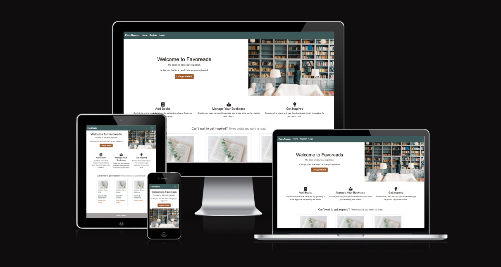

#FavoReads

Welcome,

In this document I will explain the reason and approach behind the FavoReads app. Imagine this, you just finished reading a good book, and now you have to look for another one. You don't have any inspiration and therefore you just my browse Amazon for hours. Wouldn't it be so much nicer to get book inspiration from someone who inspires you? Do you admire that one soccer player, or that bosswoman? Check out their bookcase and find your next book to read. In addition, you might also be an inspiration to others, so make sure you share your bookcase as well!

FavoReads is an application where users can create their own online bookcase while also being able to see the bookcases of other users. 

The last update to this file was: **January 14, 2023**

# Deployed project
The app can be accessed via the following link: [Click to go to Website](https://favoreads.herokuapp.com/) 

# General introduction and instructions

## Project Approach
This application is built using an agile approach. Therefore, the functionalities were broken down into Epics & User stories, and these picked up in three sprints. Each sprint consisted of one week. 

## Epics & labels
The application features were broken down into Epics and hence in User Stories. 
For each User Story, a issue was created. The corresponding Epic was depicted via a label.
There were two additional labels: Front-End, Back-End. For each User Story it was often the case that there were some BE and FE functionalities. Therefore, most User Stories were split into two User Stories, one for BE, one for FE.

[All Epics/labels can be viewed here.](https://github.com/MerelMoehn/favoreads/labels)
The following Epics were defined:
- Account Management: Sign Up, Log-In, Log-Out
- Display Users & Books: the functionality of displaying a list of books or user/bookcase owners. This Epic was focused on the inspiration goal of this application.
- Add Books: this included the submitting of a new book to the application, as well as adding an existing book to one's own bookcase. Together with the next Epic, this Epic was focused on the Inspire goal of the application.
- Bookcase management: this included the management of one's own bookcase, in which a user can edit a book's status, or delete a book from the bookcase. Together with the previous Epic, this Epic was focused on the Inspire goal of the application.
- Project Prerequisites: this Epic was all about the project set-up and anything needed for project deployment.

Additional labels used:
- Bug: to label the bugs found and solved during the project
- Documentation: to label all stories related to creating the correct and sufficient documentation.
- Front-end: to label user stories focused on the Front-end
- Back-end: to label user stories focused on the Back-end

## User stories

In the table below is an overview of the distinct User Stories. What I mean by that is the following, as mentioned some user stories are divided into two: FE & BE. The User Story is only named once in the table below.
In addition, some User Stories have overlap between the EPICS, for example, messaging. These are also only named once, but may be implemented for other EPICS as well.

The total number of user stories used were: 41

| User Story ID | As a/an | I want to be able to... | So that I can... |
| --- | ----------- | ----------- | ----------- |
 | [Add Books](https://github.com/MerelMoehn/favoreads/issues?q=label%3A%22add+books%22+is%3Aclosed) | 
 | 1 | Registered User | Submit a book when not already online | share this with others | 
 | 2 | Registered User | Add an existing book to my bookcase | So I can create my online bookcase | 
 | 3 | Admin | Approve/disapprove submitted books | Ensure no books are entered double or that questionable books are allowed.| 
  | [Display Books & Users & Bookcases](https://github.com/MerelMoehn/favoreads/issues?q=label%3A%22Display+users+%26+books%22+is%3Aclosed) | 
 | 4 | Registered User | View a list of bookcase (owners) | Navigate to their bookcase and be inspired | 
 | 5 | Registered User | View the bookcase of another user | View the books in their bookcase and be inspired | 
 | 6 | Registered User | View individual books | So I can specifically add that book to my bookcase | 
 | 7 | Registered User | Display my own bookcase | So I can inspire others with the books I read |
 | 8 | Registered User | Navigate between the different site pages | So I see either books, bookcases or my own bookcase |
 | 9 | Registered User | View books paginated when more than 9 | Take the content to me in structured fashion |
 | 10 | Developer | Create auto generated slugs | Connect books & bookcase detail pages to the correct book/bookcase | 
 | 11 | Site Owner | Showcase a few books & functionalities | Give website visitors a quick sense of the types of books and functionalities available on my website | 
  | [Manage Bookcase](https://github.com/MerelMoehn/favoreads/issues?q=label%3A%22Manage+Bookcase%22+is%3Aclosed) | 
 | 12 | Registered User | Update the reading status of my book | Show others an up to date bookcase | 
 | 13 | Registered User | Delete a book out of my bookcase | Show others an up to date bookcase |
 | 14 | Registered User | Automatically add a submitted book to my bookcase | So that I don't have to do this manually |
 | 15 | Registered User | See a confirmation message of my action | So that I know what is happening |
 | [Account Management](https://github.com/MerelMoehn/favoreads/issues?q=label%3A%22Account+management%22+is%3Aclosed) | 
 | 16 | Unregistered User | Easily register for an account | Join this book community | 
 | 17 | Registered User | Easily login or logout | View bookcases, upload books, and manage my bookcase | 
 | 18 | Registered User | Easily recover my password | Access my account even if I've forgotten my password | 
 | 19 | Unregistered User | Get an impression of the application from the homepage | Understand what the project is about | 
  | [Project Prerequisites](https://github.com/MerelMoehn/favoreads/issues?q=label%3A%22project+prerequisites%22+is%3Aclosed) | 
 | 20 | Developer | Set up my project | Build the base layout of my application |
 | 21 | Developer | Create the Data Models | Support my application with data | 
 | 22 | Developer | Deploy my application early | Check frequently if everything is working properly | 
 | 23 | Developer | Create automated tests | Ensure a reliable application | 
 | 24 | Developer | Create understandable code via commenting | Help other developers understand it |
  | [Documentation](https://github.com/MerelMoehn/favoreads/issues?q=label%3Adocumentation+is%3Aclosed) |
| 25 | Developer | Create Wireframes | Ensure my application is properly designed | 
| 26 | Developer | Create a LucidChart Data Model | Ensure my Data Models are designed & documented correctly | 
| 27 | Developer | Document in a ReadMe file | Ensure my application is documented correctly & sufficiently | 

## Project Planning
The project was planned and built in three sprints each consisting of one week. The project tool used was GitHub Projects & Issues. The issues were mapped on a kanban board using Epic, and FE&BE labels.

When I started working on an User Story, the story was added to the milestone and dragged and dropped into "in progress", when finished, the story was dragged & dropped into the "done" lane.
To clarify, I only noticed when having finished 95% of my project that setting a story to 'done' did not close the story. Therefore most of the stories have the same closing date.

I decided to focus on creating the main back-end functionalities first before focusing on front-end. This decision was made based on the availability of support during the Christmas holidays. 

[View stories included in sprint 1.](https://github.com/MerelMoehn/favoreads/milestone/1?closed=1)
[View stories included in sprint 2.](https://github.com/MerelMoehn/favoreads/milestone/2?closed=1)
[View stories included in sprint 3.](https://github.com/MerelMoehn/favoreads/milestone/3)

# Features
This application has several features which I will highlight per page.

- On the 'Home' page (index.html) the user can make us of the following features:
  - Register
  - Log-in
  - Log-out
  - Go to the detail pages of three highlighted books, ordered based on last submitted
- On the 'Submit a book' page (submit_book.html) the user can make us of the following features:
  - Fill in the form to submit a book
  - Get feedback whether the action above has succeeded or not
- On the 'My Bookcase' page (user_bookcase.html) the user can make us of the following features:
  - See all the books in his/her bookcase
  - Update the reading status of each book in the bookcase
  - Delete a book from the bookcase
  - Receive a message when doing one of the above two actions
  - Navigate between pages of books in the bookcase (pagination)
- On the 'Bookcases' page (bookcases.html) the user can make use of the following features:
  - See a list of other user of the application
  - Click on a user to go to their bookcase
  - Navigate between pages of users in the list (pagination)
- On the 'Bookcase detail' page (bookcase_detail.html) the user can make us of the following features:
  - See all the books in the bookcase of the selected user
  - Click on a book to go to the book_detail page
  - Navigate between pages of books in the bookcase (pagination)
- On the 'Book detail' page (book_detail.html) the user can make use of the following features:
  - See the book details
  - Add the book to his/her own bookcase
  - Get feedback whether the action above has succeeded or not

The admin user has additional functionalities:
  - Log in to the admin panel
  - Review Users, Books, and Bookcase_books
  - Approve Books

## Future Features
The following features would be nice to add in the future:

- BookClub/Commenting functionality: it would be nice if FavoReads could also act as a BookClub community. One feature could therefore be to allow commenting on a specific book to be able to discuss the book online. 

- Bookcase ratings functionality: it could be a nice idea to allow users to like other users' bookcases. While 'likes' are also scrutinized on social media because they are not good for mental health it could increase the application engagement.

- Search functionality: being able to search the website for a book or bookcase owner via a search bar would probably increase the user experience. 

# Design & wireframing
## Colourscheme
The design of the FavoReads application is based on the image below. Four colours are extracted and used for the main elements on the page. An additional colour was picked for the typografie. 
* Color for NavBar and Icons: #41585A
* Color for buttons and excerpt: #9A602A
* Color for background and white text: #F2EEED
* Color for footer and author: #A19F9E
* Color for text: #241F1C

## Typography

- The typography used within the application is the following font-family: Arial, Helvetica, sans-serif. These fonts were used because they are a fairly safe choice and do not distract the attention from the books. 

## Cards
- I have used Bootstrap cards to visually organise content and to make the bookcase pages look like an actual bookcase.

## Icons
- I used icons from Font Awesome website. They are used on the index page to depict the three main features of the website.

## Imagery 
- Imagery is used to give the application a more sophisticated look and to make it feel like an actual online bookcase.
- Images are mostly displayed within Bootstrap cards to mock the idea of a bookcase depicting multiple books next to each other.
- The user is able to provide an image of the book when submitting a book. When no book is uploaded the default book image is used.
- The images have been downloaded from Unsplash.com

## WireFrames
[Click here for related user story.](https://github.com/MerelMoehn/favoreads/issues/20)
The wireframes created for this project were made in the online tool Miro. 

The wireframes were used as a rough sketch of what the application was meant to do and look like. This included the page navigation, the different pages needed, and a rough sketch of the design.
After initial set up of the main features the design was further implemented based on the design as described above.

# Data model
[Click here for related user story.](https://github.com/MerelMoehn/favoreads/issues/14)
The data model was created in LucidChart. 
The first data model included three models: Book, Bookcase, Bookcase_Book.
After implementing the first features and templates I realized that there was no need for three different models and that two models would suffice: Book and Bookcase_book. As the Bookcase_Book combines both the owner of the bookcase and the specific books, it acts as they bookcase for different users.

## The Book model
The Book model includes the following fields:
* Title: The title of the book, which needs to be unique. 
* Slug: A unique auto generated slug that will be used to create the  URL to navigate to a specific bookpage.
* Author: The author of the book. Does not have to be unique.
* Excerpt: A short one or two sentence description of the book.
* Featured_image: A picture of the book. A default is provided when the user does not upload an image. 
* Created_on: The Data and Time the book was created on.
* Approved: A True or False field, whether or not the admin has approved the book.
* Submitted_by: A foreign key to the User that has submitted the book
* Deleted: A True or False field, to show whether or not the book has been soft deleted. Based on advise of my mentor it was not a hard delete but a soft delete.
The Book model also has a method that auto generates a slug based on the title of the book. 

## The Bookcase_book Model
The Bookcase_book model includes the following fields:
* Bookcase_owner: A ForeignKey of the model User. Registers which User has added this book to his/her bookcase.
* Book: A ForeignKey of the model Book. Registers which Book it is about.
* Status: A choice field of which the choices are: Reading, Not Started, Read. To indicate whether or not the bookcase owner has read the book in his bookcase.
* Created_on: A DateTime field indicating when the Bookcase_book was created. This data is used to order the bookcase_books on descending DateTime.

# Technology used
## Languages used
- [HTML5](https://en.wikipedia.org/wiki/HTML5)
- [CSS](https://en.wikipedia.org/wiki/CSS)
- [JavaScript](https://en.wikipedia.org/wiki/JavaScript)
- [Python](https://en.wikipedia.org/wiki/Python_(programming_language))

## Frameworks & Libraries used
- [Django](https://www.djangoproject.com/)
  - This website is built using Django, a high-level Python web framework. I have also used Django to provide an admin view, create forms and test my website. Further features used include 
  - [Django Allauth](https://django-allauth.readthedocs.io/en/latest/index.html) I used Allauth for user authentification. 
  - [Django Crispy Forms](https://django-crispy-forms.readthedocs.io/en/latest/)I used Crispy Forms for styling my form.

- [jQuery](https://jquery.com/)
  - I used jQuery to add functionality to Bootstrap components and within my scripts.

- [Bootstrap 4](https://getbootstrap.com/) 
  - I used bootstrap throughout the site to make it responsive. I sourced code from the Bootstrap documentation when building the Navbar, Cards, Messages and Buttons.

- [Google Fonts](https://fonts.google.com/)
  - Fonts are imported from google fonts.
  
- [Font awesome](https://fontawesome.com/)
  - I used icons from font awesome on the index page.

- [Cloudinary](https://cloudinary.com/)
  - I used images that were stored on Cloudinary.

# Testing
## Validators
### CI Python Linter
All custom code passed the the CI Python Linter validation, without any errors.
The following files were passed through the linter:
* admin.py
* apps.py
* forms.py
* models.py
* test_admin.py
* test_forms.py
* test_models.py
* test_views.py
* urls.py
* views.py

### Lighthouse
Each site page has been checked with Lighthouse and the following improvements have been made:
* Using smaller images to load page faster
* include meta tag on page
* Language has been set in base.html
* Non unique ARIA IDs are made unique
* Remove big layout shift with buttons for user bookcase
After these changes all pages score green numbers.

### W3C CSS Validation
The style.css code has been validated by the W3C CSS validator and passed without any errors.

## Manual Testing
Most manual testing has been done to check responsiveness and to complete a final walkthrough of the functionalities. This resulted in the bug to fix the responsiveness of the 'My Bookcase page'. [Go to bug.](https://github.com/MerelMoehn/favoreads/issues/41) 

## Automated testing
In total there are 21 one automated test which cover 100% of the application.

All tests pass. 

## Bugs found and solved
Throughout the project there were multiple bugs found and solved. These bugs were logged on the GitHub project and can be reviewed via the following link: [Click here to review the bugs.](https://github.com/MerelMoehn/favoreads/issues?q=label%3Abug+is%3Aclosed) 

### Unsolved bugs
At the moment of submitting and deployment, there were no unresolved bugs.

# Deployment
## Heroku
The project was deployed to Heroku using the following steps:
1. I pushed my final code via the terminal after finishing the project.
2. I created a new Heroku app
3. I set the build backs to 'Python' and 'NodeJS' in that order
4. I linked the Heroku app to the repository
5. I pushed my final code via the terminal after finishing the project.
6. Then I selected 'deploy'

## ElephantSQL
The database was set up by following the steps beneath:
1. Log in to ElephantSQL.com to access your dashboard
2. Click “Create New Instance”
3. Set up your plan
4. Select “Select Region”
5. Select a data center near you
6. Then click “Review”
7. Check your details are correct and then click “Create instance”
8. Return to the ElephantSQL dashboard and click on the database instance name for this project
9. In the URL section, click the copy icon to copy the database URL
10. The proper steps were taken in the settings.py file to connect with the database.

## Creating a local clone
You can create a local clone of the repository via the following steps:
1. navigate to the main page of the repository
2. download the code
3. Copy the URL for the repository.
4. Open Terminal
5. Change the current working directory to the location where you want the cloned directory.
6. Type git clone, and then paste the URL you copied earlier.
7. Press Enter to create your local clone.

For more detailed instructions, navigate to the following page:
https://docs.github.com/en/repositories/creating-and-managing-repositories/cloning-a-repository

# Credits
## Code
### Code Institute:
  - I based the set up of this project on the Code Institute Django walkthrough projects. I have customised my website wherever possible.

### Django:
  - I referred to the Django documentation whilst building my project.

### Bootstrap:
  - I have used Bootstrap classes throughout my project, including for layout utilities and cards. I sourced code from the Bootstrap documentation when building the Navbar, Cards, Dropdown, and pagination.

## Acknowledgements
- Thank you to my mentor for helpful feedback, industry insights and recommended tools.

- Thank you to the tutors and staff at Code Institute for their support.

Thank you!